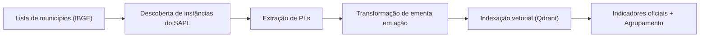

[](https://nextjs.org/)
[](https://huggingface.co/)
[](https://qdrant.tech/)
[](https://nodejs.org/)

**Sonar Municipal** é uma plataforma web para apoiar a elaboração e a análise de Projetos
de Lei (PLs) em municípios, em um contexto de alta diversidade legislativa. O sistema
padroniza e automatiza a descoberta e coleta de PLs em instâncias do SAPL, transforma
ementas em recomendações de ação, permite busca semântica por demandas dos usuários,
simula efeitos em indicadores oficiais ao longo do tempo e agrupa PLs semelhantes em
**políticas públicas** para análise conjunta.

# Como funciona?

<p align="center">
  <b>Figura 1:</b> Pipeline conceitual do Sonar Municipal.
</p>

## API
As rotas seguem a lógica do pipeline em `experiments/notebooks`.

- `GET /api/health` retorna status e valida variáveis obrigatórias.
- `POST /api/search` recebe `{ "query": "...", "top_k": 50 }` e devolve PLs similares.
- `POST /api/policies` agrupa PLs por ação e calcula qualidade via indicador.
- `GET /api/indicators` lista indicadores disponíveis.

Exemplo rápido:
```bash
curl -X POST http://localhost:3000/api/search \
  -H "Content-Type: application/json" \
  -d '{ "query": "Como reduzir homicídios no município?", "top_k": 25 }'
```

## Variáveis de ambiente
Crie `.env.local` na raiz:
```bash
HF_API_TOKEN=...
QDRANT_URL=https://seu-cluster.qdrant.io
QDRANT_API_KEY=...
QDRANT_COLLECTION=projetos-de-lei
HF_MODEL_ID=embaas/sentence-transformers-multilingual-e5-base
SEARCH_MAX_RESULTS=1000

# Indicadores (dados reais)
CRIMINAL_INDICATOR_PATH=indicators/homicidios.csv
CRIMINAL_INDICATOR_CITY_COL=municipio_norm
CRIMINAL_INDICATOR_VALUE_COL=taxa_homicidios_100k
CRIMINAL_INDICATOR_MIN_VALUE=5
EDUCATION_INDICATOR_PATH=indicators/matriculas.csv
EDUCATION_INDICATOR_CITY_COL=municipio
EDUCATION_INDICATOR_VALUE_COL=taxa_matriculas_100k
```

## Instalação
Requisitos: Node.js 18+ e npm.

```bash
npm install
```

## Uso básico
```bash
npm run dev
```
- Aplicação: http://localhost:3000
- API: http://localhost:3000/api/...

Build de produção:
```bash
npm run build
npm start
```

## Experimentos e Reprodutibilidade
Os notebooks e os scripts de coleta ficaram em `experiments/`. Para reconstruir
o dataset do zero, use os atalhos abaixo:

| Link | Descrição |
| --- | --- |
| [](experiments/README.MD) | Visão geral do pipeline e guias de execução. |
| [](experiments/DATASET.MD) | Passo a passo para reconstruir o dataset final (`dataset.npy`). |
| [](experiments/core/README.MD) | Documentação do módulo `core`. |
| [](experiments/tools/sapl_finder/README.MD) | Descoberta de instâncias do SAPL. |
| [](experiments/tools/sapl_scrapper/README.MD) | Raspagem de projetos de lei. |
| [](experiments/notebooks) | Notebooks de análises, inferência e fine-tuning. |

Resumo do pipeline:
1. Descobrir instâncias do SAPL (`tools/sapl_finder`).
2. Raspar projetos de lei (`tools/sapl_scrapper`).
3. Gerar ações a partir das ementas (modelo `ptt5v2-pl-text2action`).
4. Gerar embeddings e montar `dataset.npy`.

## Estrutura do repositório
- `src/app`: páginas e rotas de API do Next.js.
- `public/`: assets do frontend (inclui o banner).
- `experiments/`: backend antigo, notebooks e ferramentas de dados.
