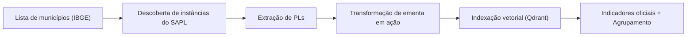

<div align="center">


[](https://nextjs.org/)
[](https://huggingface.co/)
[](https://qdrant.tech/)
[](https://nodejs.org/)
[](https://www.python.org/)
[](https://doi.org/10.5281/zenodo.20387514)
[](https://doi.org/10.5281/zenodo.20564283)
[](https://doi.org/10.5281/zenodo.20564326)

</div>

# Sonar Municipal

**Sonar Municipal** é uma plataforma web para apoiar a elaboração e a análise de Projetos de Lei
(PLs) municipais em um cenário de altíssima diversidade legislativa. O sistema padroniza e
automatiza a descoberta e a coleta de PLs em instâncias do sistema SAPL, transforma ementas
jurídicas em recomendações de ação objetivas, permite busca semântica a partir das demandas dos
usuários, simula efeitos em indicadores oficiais ao longo do tempo e agrupa PLs semelhantes em
**políticas públicas** para análise conjunta.

Este repositório contém o **componente de software** de um conjunto reprodutível publicado como
parte do Trabalho de Conclusão de Curso *"Mineração de Dados e Busca Semântica Aplicadas à Análise
de Projetos de Lei Municipais"* (ICMC-USP, 2026).

## Sumário

- [Funcionalidades](#funcionalidades)
- [Como funciona](#como-funciona)
- [Artefatos reprodutíveis](#artefatos-reprodutíveis)
- [Arquitetura](#arquitetura)
- [API](#api)
- [Variáveis de ambiente](#variáveis-de-ambiente)
- [Instalação](#instalação)
- [Uso](#uso)
- [Experimentos e reprodutibilidade](#experimentos-e-reprodutibilidade)
- [Estrutura do repositório](#estrutura-do-repositório)
- [Licença, citação e contato](#licença-citação-e-contato)

## Funcionalidades

- **Coleta automatizada de PLs** em portais do SAPL de municípios brasileiros, a partir da lista
  oficial de municípios do IBGE.
- **Transformação ementa → ação**: reescreve a ementa jurídica de cada PL em uma recomendação de
  ação imperativa, curta e fiel ao texto, usando um modelo de linguagem dedicado.
- **Busca semântica** por demandas formuladas em linguagem natural (ex.: *"Como reduzir homicídios
  no município?"*), com recuperação densa sobre embeddings multilíngues.
- **Simulação de efeitos**: cruza os PLs com indicadores oficiais (segurança, educação) e estima a
  variação do indicador na janela seguinte à apresentação do projeto.
- **Agrupamento em políticas públicas**: reúne PLs estruturalmente semelhantes e ordena as
  políticas por um critério de qualidade baseado nos efeitos observados.

## Como funciona


```mermaid
flowchart LR
  E1["Lista de municípios (IBGE)"] --> E2["Descoberta de instâncias do SAPL"]
  E2 --> E3["Extração de PLs"]
  E3 --> E4["Transformação de ementa em ação"]
  E4 --> E5["Indexação vetorial (Qdrant)"]
  E5 --> E6["Indicadores oficiais + Agrupamento"]
```

<p align="center"><b>Figura 1:</b> Pipeline conceitual do Sonar Municipal.</p>

O pipeline parte da lista de municípios do IBGE, descobre os portais do SAPL ativos, extrai os
Projetos de Lei, reescreve cada ementa como ação, indexa os vetores resultantes no Qdrant e, por
fim, cruza tudo com indicadores oficiais para agrupar PLs em políticas. O detalhamento de cada
etapa — e como reproduzi-las — está em [`experiments/`](experiments/README.MD).

## Artefatos reprodutíveis

O conjunto publicado como parte do TCC é composto por:

| Artefato | Licença | DOI / Hub |
| --- | --- | --- |
| **Código-fonte** (este repositório) | MIT | Zenodo `10.5281/zenodo.20387514` |
| **Dataset** (benchmark TREC-style + corpus de 241k ações) | CC-BY-4.0 | [Hugging Face Hub](https://huggingface.co/datasets/thiagoambiel/sonar-municipal-pl-actions) · Zenodo `10.5281/zenodo.20564283` |
| **Modelo** PTT5 base ementa→ação | Apache-2.0 | [Hugging Face Hub](https://huggingface.co/thiagoambiel/sonar_municipal_ptt5_ementa2action) · Zenodo `10.5281/zenodo.20564326` |
| **Demo** (Gradio Space) | — | [Hugging Face Spaces](https://huggingface.co/spaces/thiagoambiel/sonar-municipal-demo) |
| **Tese** (TCC) | — | BDTD-USP (a ser vinculado quando o depósito institucional existir) |

## Arquitetura

A plataforma é uma aplicação **Next.js** que consome dois serviços externos em tempo de execução:

- **Qdrant** — banco vetorial que armazena os embeddings das ações de todos os PLs, na collection
  `projetos-de-lei`; responde às buscas por similaridade de cosseno.
- **Inference API do Hugging Face** — gera o embedding da consulta do usuário no momento da busca,
  com o mesmo modelo usado para indexar o corpus.

Os indicadores oficiais (CSV) são lidos do disco e cruzados com os PLs para estimar efeitos. Toda
a etapa de coleta, transformação e indexação vive em [`experiments/`](experiments/README.MD) e
roda offline; a aplicação web apenas consulta os artefatos já preparados.

## API

As rotas seguem a lógica do pipeline documentado em [`experiments/`](experiments/README.MD):

| Método e rota | Descrição |
| --- | --- |
| `GET /api/health` | Retorna o status do serviço e valida as variáveis de ambiente obrigatórias. |
| `POST /api/search` | Recebe `{ "query": "...", "top_k": 50 }` e devolve os PLs mais similares. |
| `POST /api/policies` | Agrupa PLs por ação e calcula a qualidade de cada política via indicador. |
| `GET /api/indicators` | Lista os indicadores configurados e disponíveis. |

Exemplo de requisição:

```bash
curl -X POST http://localhost:3000/api/search \
  -H "Content-Type: application/json" \
  -d '{ "query": "Como reduzir homicídios no município?", "top_k": 25 }'
```

Cada resultado traz, entre outros campos, `municipio`, `uf`, `acao`, `ementa`, `data_apresentacao`
e o link público para o PL na origem.

## Variáveis de ambiente

Crie um arquivo `.env.local` na raiz (use [`.env.example`](.env.example) como base):

```bash
HF_API_TOKEN=...
QDRANT_URL=https://seu-cluster.qdrant.io
QDRANT_API_KEY=...
QDRANT_COLLECTION=projetos-de-lei
HF_MODEL_ID=embaas/sentence-transformers-multilingual-e5-base
SEARCH_MAX_RESULTS=1000

# Indicadores (dados reais)
CRIMINAL_INDICATOR_PATH=indicators/homicidios.csv
CRIMINAL_INDICATOR_CITY_COL=municipio_norm
CRIMINAL_INDICATOR_VALUE_COL=taxa_homicidios_100k
CRIMINAL_INDICATOR_MIN_VALUE=5
EDUCATION_INDICATOR_PATH=indicators/matriculas.csv
EDUCATION_INDICATOR_CITY_COL=municipio
EDUCATION_INDICATOR_VALUE_COL=taxa_matriculas_100k
```

| Variável | Descrição |
| --- | --- |
| `HF_API_TOKEN` | **Obrigatória.** Token da Inference API do Hugging Face, usado para embedar a consulta a cada busca. Sem ele, `/api/search` e `/api/policies` falham. |
| `QDRANT_URL` / `QDRANT_API_KEY` | Endereço e chave do cluster Qdrant que hospeda a collection de vetores. |
| `QDRANT_COLLECTION` | Nome da collection consultada (padrão `projetos-de-lei`). |
| `HF_MODEL_ID` | Modelo de embeddings; deve ser o mesmo usado na indexação (768 dimensões, cosseno). |
| `SEARCH_MAX_RESULTS` | Teto de resultados retornados pela busca. |
| `CRIMINAL_INDICATOR_*` / `EDUCATION_INDICATOR_*` | Caminho do CSV, coluna de município e coluna de valor de cada indicador, além do valor mínimo elegível. |

## Instalação

Requisitos: **Node.js 18+** e **npm**.

```bash
npm install
```

## Uso

Ambiente de desenvolvimento:

```bash
npm run dev
```

- Aplicação: <http://localhost:3000>
- API: `http://localhost:3000/api/...`

Build de produção:

```bash
npm run build
npm start
```

## Experimentos e reprodutibilidade

Os notebooks e os scripts ficam em [`experiments/`](experiments/README.MD). O caminho recomendado
parte dos artefatos publicados no Hugging Face; reconstruir tudo do zero é opcional.

| Guia | Descrição |
| --- | --- |
| [Visão geral dos experimentos](experiments/README.MD) | Pipeline completo e atalhos de execução. |
| [Guia do dataset](experiments/DATASET.MD) | Passo a passo para obter `dataset.npy` e a collection do Qdrant. |
| [Módulo `core`](experiments/core/README.MD) | Funções de busca, embeddings e geração de políticas. |
| [`sapl_finder`](experiments/tools/sapl_finder/README.MD) | Descoberta de instâncias do sistema SAPL. |
| [`sapl_scrapper`](experiments/tools/sapl_scrapper/README.MD) | Raspagem de Projetos de Lei. |

**Resumo do caminho rápido:**

1. Baixar o dataset publicado [`thiagoambiel/sonar-municipal-pl-actions`](https://huggingface.co/datasets/thiagoambiel/sonar-municipal-pl-actions) (subset `default`).
2. Gerar os embeddings das ações e montar `experiments/data/dataset.npy`.
3. Subir os pontos ao Qdrant (collection `projetos-de-lei`) com `upload_data_to_qdrant.ipynb` para
   **hospedar a plataforma** (exige `HF_API_TOKEN` em tempo de execução).

Para reconstruir do zero (atualizar o corpus com novos PLs ou auditar a coleta): descobrir
instâncias do sistema SAPL (`tools/sapl_finder`), raspar os PLs (`tools/sapl_scrapper`) e gerar as
ações com o modelo [`thiagoambiel/sonar_municipal_ptt5_ementa2action`](https://huggingface.co/thiagoambiel/sonar_municipal_ptt5_ementa2action).
Detalhes em [`experiments/DATASET.MD`](experiments/DATASET.MD).

## Estrutura do repositório

- `src/app/` — páginas e rotas de API do Next.js.
- `public/` — assets do frontend (inclui o banner).
- `scripts/` — utilitários do frontend (ex.: geração de exemplos do Policy Explorer).
- `experiments/` — módulo `core/`, notebooks e ferramentas de dados.
- `indicators/` — indicadores oficiais (CSV) consumidos pela plataforma.

## Licença, citação e contato

- **Licença:** MIT — veja [LICENSE](LICENSE).
- **Citação:** consulte [CITATION.cff](CITATION.cff) ao referenciar este trabalho.
- **Segurança:** para reportar vulnerabilidades, veja [SECURITY.md](SECURITY.md).
- **Contribuições:** veja [CONTRIBUTING.md](CONTRIBUTING.md).
- **Contato:** Thiago Ambiel — <thiago.ambiel@usp.br>
