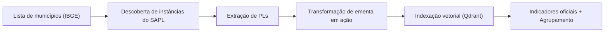

[](https://nextjs.org/)
[](https://huggingface.co/)
[](https://qdrant.tech/)
[](https://nodejs.org/)
[](https://www.python.org/)

**Sonar Municipal** é uma plataforma web para apoiar a elaboração e a análise de Projetos
de Lei (PLs) em municípios, em um contexto de alta diversidade legislativa. O sistema
padroniza e automatiza a descoberta e coleta de PLs em instâncias do SAPL, transforma
ementas em recomendações de ação, permite busca semântica por demandas dos usuários,
simula efeitos em indicadores oficiais ao longo do tempo e agrupa PLs semelhantes em
**políticas públicas** para análise conjunta.

## Companion artifacts

Este repositório é o componente de software de um conjunto reprodutível publicado como
parte do TCC *"Mineração de Dados e Busca Semântica Aplicadas à Análise de Projetos
de Lei Municipais"* (ICMC-USP, 2026):

| Artefato | Licença | DOI / Hub |
| --- | --- | --- |
| **Código-fonte** (este repo) | MIT | Zenodo `10.5281/zenodo.20387514` |
| **Dataset** (TREC-style benchmark + corpus de 241k ações) | CC-BY-4.0 | [Hugging Face Hub](https://huggingface.co/datasets/thiagoambiel/sonar-municipal-pl-actions) · Zenodo `10.5281/zenodo.<DS-CONCEPT-PREENCHER>` |
| **Modelo** PTT5-v2 ementa→ação | Apache-2.0 | Zenodo `10.5281/zenodo.<MD-CONCEPT-PREENCHER>` · [Hugging Face Hub](https://huggingface.co/thiagoambiel/sonar_municipal_ptt5_ementa2action) |
| **Demo** (Gradio Space) | — | [Hugging Face Spaces](https://huggingface.co/spaces/thiagoambiel/sonar-municipal-demo) |
| **Tese** (TCC) | — | BDTD-USP handle (a ser vinculado quando o depósito institucional existir) |

# Como funciona?

```mermaid
flowchart LR
  E1["Lista de municípios (IBGE)"] --> E2["Descoberta de instâncias do SAPL"]
  E2 --> E3["Extração de PLs"]
  E3 --> E4["Transformação de ementa em ação"]
  E4 --> E5["Indexação vetorial (Qdrant)"]
  E5 --> E6["Indicadores oficiais + Agrupamento"]
```
<p align="center">
  <b>Figura 1:</b> Pipeline conceitual do Sonar Municipal.
</p>

## API
As rotas seguem a lógica do pipeline em `experiments/notebooks`.

- `GET /api/health` retorna status e valida variáveis obrigatórias.
- `POST /api/search` recebe `{ "query": "...", "top_k": 50 }` e devolve PLs similares.
- `POST /api/policies` agrupa PLs por ação e calcula qualidade via indicador.
- `GET /api/indicators` lista indicadores disponíveis.

Exemplo rápido:
```bash
curl -X POST http://localhost:3000/api/search \
  -H "Content-Type: application/json" \
  -d '{ "query": "Como reduzir homicídios no município?", "top_k": 25 }'
```

## Variáveis de ambiente
Crie `.env.local` na raiz:
```bash
HF_API_TOKEN=...
QDRANT_URL=https://seu-cluster.qdrant.io
QDRANT_API_KEY=...
QDRANT_COLLECTION=projetos-de-lei
HF_MODEL_ID=embaas/sentence-transformers-multilingual-e5-base
SEARCH_MAX_RESULTS=1000

# Indicadores (dados reais)
CRIMINAL_INDICATOR_PATH=indicators/homicidios.csv
CRIMINAL_INDICATOR_CITY_COL=municipio_norm
CRIMINAL_INDICATOR_VALUE_COL=taxa_homicidios_100k
CRIMINAL_INDICATOR_MIN_VALUE=5
EDUCATION_INDICATOR_PATH=indicators/matriculas.csv
EDUCATION_INDICATOR_CITY_COL=municipio
EDUCATION_INDICATOR_VALUE_COL=taxa_matriculas_100k
```

## Instalação
Requisitos: Node.js 18+ e npm.

```bash
npm install
```

## Uso básico
```bash
npm run dev
```
- Aplicação: http://localhost:3000
- API: http://localhost:3000/api/...

Build de produção:
```bash
npm run build
npm start
```

## Experimentos e Reprodutibilidade
Os notebooks e os scripts ficam em `experiments/`. O caminho recomendado parte dos artefatos
publicados no Hugging Face; reconstruir do zero é opcional. Use os atalhos abaixo:

| Link | Descrição |
| --- | --- |
| [](experiments/README.MD) | Visão geral do pipeline e guias de execução. |
| [](experiments/DATASET.MD) | Passo a passo para reconstruir o dataset final (`dataset.npy`). |
| [](experiments/core/README.MD) | Documentação do módulo `core`. |
| [](experiments/tools/sapl_finder/README.MD) | Descoberta de instâncias do SAPL. |
| [](experiments/tools/sapl_scrapper/README.MD) | Raspagem de projetos de lei. |
| [](experiments/notebooks) | Notebooks de análises, inferência e fine-tuning. |

Resumo do pipeline (caminho rápido):
1. Baixar o dataset publicado [`thiagoambiel/sonar-municipal-pl-actions`](https://huggingface.co/datasets/thiagoambiel/sonar-municipal-pl-actions) (subset `default`).
2. Gerar os embeddings das ações e montar `experiments/data/dataset.npy`.
3. Subir os pontos ao Qdrant (collection `projetos-de-lei`) com `upload_data_to_qdrant.ipynb`
   para **hospedar a plataforma** (exige `HF_API_TOKEN` em runtime).

Opcional (reconstruir do zero): descobrir instâncias do sistema SAPL (`tools/sapl_finder`),
raspar PLs (`tools/sapl_scrapper`) e gerar ações com o modelo
`thiagoambiel/sonar_municipal_ptt5_ementa2action` — detalhes em `experiments/DATASET.MD`.

## Estrutura do repositório
- `src/app`: páginas e rotas de API do Next.js.
- `public/`: assets do frontend (inclui o banner).
- `scripts/`: utilitários do front (ex.: geração de exemplos do Policy Explorer).
- `experiments/`: módulo `core/`, notebooks e ferramentas de dados.
