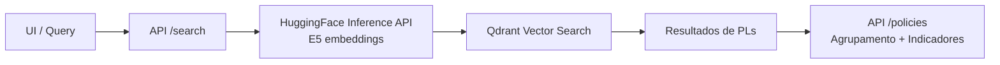

[](https://nextjs.org/)
[](https://huggingface.co/)
[](https://qdrant.tech/)
[](https://nodejs.org/)

**Sonar Municipal** e uma aplicacao Next.js (App Router) com rotas `/api` que gera
embeddings via HuggingFace Inference API e faz busca semantica no Qdrant. Alem da
busca, o backend agrupa projetos semelhantes em **politicas** e calcula efeitos
com indicadores reais (ex.: homicidios, matriculas).

# How it Works?

<p align="center">
  <b>Figure 1:</b> Fluxo de busca semantica e geracao de politicas.
</p>

## API (rotas Next.js)
As rotas seguem a logica do pipeline em `experiments/notebooks`.

- `GET /api/health` retorna status e valida variaveis obrigatorias.
- `POST /api/search` recebe `{ "query": "...", "top_k": 50 }` e devolve PLs similares.
- `POST /api/policies` agrupa PLs por acao e calcula qualidade via indicador.
- `GET /api/indicators` lista indicadores disponiveis.

Exemplo rapido:
```bash
curl -X POST http://localhost:3000/api/search \
  -H "Content-Type: application/json" \
  -d '{ "query": "Como reduzir homicidios no municipio?", "top_k": 25 }'
```

## Environment Variables
Crie `.env.local` na raiz:
```bash
HF_API_TOKEN=...
QDRANT_URL=https://seu-cluster.qdrant.io
QDRANT_API_KEY=...
QDRANT_COLLECTION=projetos-de-lei
HF_MODEL_ID=embaas/sentence-transformers-multilingual-e5-base
SEARCH_MAX_RESULTS=1000

# Indicadores (dados reais)
CRIMINAL_INDICATOR_PATH=indicators/homicidios.csv
CRIMINAL_INDICATOR_CITY_COL=municipio_norm
CRIMINAL_INDICATOR_VALUE_COL=taxa_homicidios_100k
CRIMINAL_INDICATOR_MIN_VALUE=5
EDUCATION_INDICATOR_PATH=indicators/matriculas.csv
EDUCATION_INDICATOR_CITY_COL=municipio
EDUCATION_INDICATOR_VALUE_COL=taxa_matriculas_100k
```

## Installation
Requisitos: Node.js 18+ e npm.

```bash
npm install
```

## Basic Usage
```bash
npm run dev
```
- App: http://localhost:3000
- API: http://localhost:3000/api/...

Build de producao:
```bash
npm run build
npm start
```

## Experiments (pipeline completo)
O backend FastAPI original, os notebooks e os scripts de coleta ficaram em
`experiments/`. Para reconstruir o dataset do zero, use o guia:

- `experiments/DATASET.MD`

Resumo do pipeline:
1. Descobrir instancias SAPL (`tools/sapl_finder`).
2. Raspar projetos de lei (`tools/sapl_scrapper`).
3. Gerar acoes a partir das ementas (modelo `ptt5v2-pl-text2action`).
4. Gerar embeddings e montar `dataset.npy`.

## Estrutura do repositorio
- `src/app`: paginas e rotas de API do Next.js.
- `public/`: assets do frontend (inclui o banner).
- `experiments/`: backend antigo, notebooks e ferramentas de dados.

