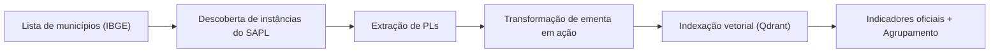

[](https://www.python.org/)
[](https://sapl.senado.leg.br/)
[](https://huggingface.co/)
[](https://qdrant.tech/)

Este diretório reúne o pipeline completo de dados do Sonar Municipal: descoberta de
instâncias SAPL, coleta de projetos de lei, transformação de ementas em ações,
indexação vetorial e análises com indicadores oficiais.

# Como funciona?

<p align="center">
  <b>Figura 1:</b> Pipeline conceitual do Sonar Municipal.
</p>

## Guias e atalhos (outros .MD)
- `DATASET.MD`: passo a passo para reconstruir o dataset final (`dataset.npy`).
- `tools/sapl_finder/README.MD`: CLI para descobrir instâncias SAPL e gerar `sapl_hosts.jsonl`.
- `tools/sapl_scrapper/README.MD`: CLI para raspar PLs das instâncias encontradas e salvar `pl.jsonl`.

## O que já está implementado
- Descoberta de SAPL (`tools/sapl_finder`).
- Raspagem de PLs (`tools/sapl_scrapper`).
- Transformação de ementas em ações (modelos HuggingFace).
  - Referência: `notebooks/sonar-municipal-ptt5-v2-fine-tuning-ementa2action.ipynb`.
- Módulo `core/` para embeddings, busca semântica e agrupamento de políticas.
- Notebooks para construção do dataset e análises com indicadores.

## Atalhos de execução
- Descobrir SAPLs:
  ```bash
  python tools/sapl_finder/sapl_finder.py --concurrency 200 --out-jsonl data/sapl_hosts.jsonl
  ```
- Raspar PLs:
  ```bash
  python tools/sapl_scrapper/sapl_scrapper.py --in-jsonl data/sapl_hosts.jsonl --out-jsonl data/pl.jsonl
  ```
- Reconstruir o dataset:
  ```bash
  # Consulte o guia detalhado em DATASET.MD
  ```

## Estrutura do diretório
- `core/`: funções de dados, embeddings, busca e políticas.
- `tools/`: scripts de descoberta e raspagem.
- `notebooks/`: geração de ações, embeddings e análises.
- `DATASET.MD`: guia detalhado de reconstrução do dataset.
