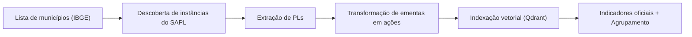

[](https://www.python.org/)
[](https://sapl.senado.leg.br/)
[](https://huggingface.co/)
[](https://qdrant.tech/)

Este diretório reúne o pipeline completo de dados do Sonar Municipal: descoberta de
instâncias do SAPL, coleta de projetos de lei, transformação de ementas em ações,
indexação vetorial e análises com indicadores oficiais.

# Como funciona?

```mermaid
flowchart LR
  E1["Lista de municípios (IBGE)"] --> E2["Descoberta de instâncias do SAPL"]
  E2 --> E3["Extração de PLs"]
  E3 --> E4["Transformação de ementas em ações"]
  E4 --> E5["Indexação vetorial (Qdrant)"]
  E5 --> E6["Indicadores oficiais + Agrupamento"]
```
<p align="center">
  <b>Figura 1:</b> Pipeline conceitual do Sonar Municipal.
</p>

## Artefatos publicados (Hugging Face)
O dataset e o modelo do projeto estão publicados no Hugging Face Hub — o caminho rápido parte
deles e não exige scraping:

| Artefato | Hub |
| --- | --- |
| Dataset (corpus + pares de treino) | [`thiagoambiel/sonar-municipal-pl-actions`](https://huggingface.co/datasets/thiagoambiel/sonar-municipal-pl-actions) |
| Modelo (ementa → ação) | [`thiagoambiel/sonar_municipal_ptt5_ementa2action`](https://huggingface.co/thiagoambiel/sonar_municipal_ptt5_ementa2action) |

## Guias e atalhos
| Link | Descrição |
| --- | --- |
| [](DATASET.MD) | Como obter `dataset.npy` (caminho rápido via Hugging Face) e a collection do Qdrant. |
| [](core/README.MD) | Documentação do módulo `core` com funções de busca, embeddings e políticas. |
| [](tools/sapl_finder/README.MD) | CLI para descobrir instâncias do sistema SAPL e gerar `sapl_hosts.jsonl` (caminho do zero). |
| [](tools/sapl_scrapper/README.MD) | CLI para raspar PLs das instâncias encontradas e salvar `pl.jsonl` (caminho do zero). |

## O que já está implementado
- Módulo `core/` para embeddings, busca semântica e agrupamento de políticas.
- Construção do `dataset.npy` a partir do dataset publicado no Hugging Face.
- Indexação vetorial no Qdrant para a plataforma (`notebooks/upload_data_to_qdrant.ipynb`).
- Caminho do zero: descoberta no sistema SAPL (`tools/sapl_finder`), raspagem de PLs
  (`tools/sapl_scrapper`) e transformação de ementas em ações com o modelo PTT5 publicado.
- Notebooks de análises e fine-tuning do modelo.

## Atalhos de execução

**Caminho rápido (recomendado) — a partir do Hugging Face:**
- Montar o `dataset.npy` (baixa o corpus publicado e gera os embeddings): rode
  `notebooks/SonarMunicipal_Build_the_Base_Action_Recommendation_Dataset.ipynb`. Passo a passo em
  `DATASET.MD`.
- Hospedar a plataforma (collection Qdrant `projetos-de-lei`): rode
  `notebooks/upload_data_to_qdrant.ipynb` e configure `QDRANT_*` + `HF_API_TOKEN` no `.env.local`.

**Caminho do zero (opcional) — para atualizar/auditar a coleta:**
```bash
python tools/sapl_finder/sapl_finder.py --concurrency 200 --out-jsonl data/sapl_hosts.jsonl
python tools/sapl_scrapper/sapl_scrapper.py --in-jsonl data/sapl_hosts.jsonl --out-jsonl data/pl.jsonl
```
Depois gere as ações com o modelo e monte o dataset — detalhes em `DATASET.MD`.

## Estrutura do diretório
- `core/`: funções de dados, embeddings, busca e políticas.
- `tools/`: scripts de descoberta e raspagem.
- `notebooks/`: geração de ações, embeddings e análises.
