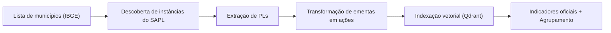

<div align="center">


[](https://www.python.org/)
[](https://sapl.senado.leg.br/)
[](https://huggingface.co/)
[](https://qdrant.tech/)

</div>

# Pipeline de dados — Sonar Municipal

Este diretório reúne todo o pipeline de dados do Sonar Municipal: a descoberta de instâncias do
sistema SAPL, a coleta de Projetos de Lei, a transformação de ementas em ações, a indexação
vetorial e as análises com indicadores oficiais. É aqui que se prepara o arquivo `dataset.npy`
consumido pelo módulo [`core/`](core/README.MD) e a collection do Qdrant usada pela plataforma.

## Sumário

- [Como funciona](#como-funciona)
- [Artefatos publicados](#artefatos-publicados-hugging-face)
- [Guias](#guias)
- [O que está implementado](#o-que-está-implementado)
- [Atalhos de execução](#atalhos-de-execução)
- [Estrutura do diretório](#estrutura-do-diretório)

## Como funciona


```mermaid
flowchart LR
  E1["Lista de municípios (IBGE)"] --> E2["Descoberta de instâncias do SAPL"]
  E2 --> E3["Extração de PLs"]
  E3 --> E4["Transformação de ementas em ações"]
  E4 --> E5["Indexação vetorial (Qdrant)"]
  E5 --> E6["Indicadores oficiais + Agrupamento"]
```

<p align="center"><b>Figura 1:</b> Pipeline conceitual do Sonar Municipal.</p>

## Artefatos publicados (Hugging Face)

O dataset e o modelo do projeto estão publicados no Hugging Face Hub. O **caminho rápido** parte
deles e dispensa a etapa de raspagem:

| Artefato | Hub |
| --- | --- |
| Dataset (corpus + pares de treino) | [`thiagoambiel/sonar-municipal-pl-actions`](https://huggingface.co/datasets/thiagoambiel/sonar-municipal-pl-actions) |
| Modelo (ementa → ação) | [`thiagoambiel/sonar_municipal_ptt5_ementa2action`](https://huggingface.co/thiagoambiel/sonar_municipal_ptt5_ementa2action) |

## Guias

| Guia | Descrição |
| --- | --- |
| [DATASET.MD](DATASET.MD) | Como obter `dataset.npy` (caminho rápido via Hugging Face) e a collection do Qdrant. |
| [core/README.MD](core/README.MD) | Documentação do módulo `core`: busca semântica, embeddings e políticas. |
| [tools/sapl_finder](tools/sapl_finder/README.MD) | CLI para descobrir instâncias do sistema SAPL e gerar `sapl_hosts.jsonl` (caminho do zero). |
| [tools/sapl_scrapper](tools/sapl_scrapper/README.MD) | CLI para raspar PLs das instâncias encontradas e salvar `pl.jsonl` (caminho do zero). |
| [tools/indicators](tools/indicators/README.MD) | Procedência dos indicadores oficiais (segurança e educação). |

## O que está implementado

- Módulo [`core/`](core/README.MD) para embeddings, busca semântica e agrupamento de políticas.
- Construção do `dataset.npy` a partir do dataset publicado no Hugging Face.
- Indexação vetorial no Qdrant para a plataforma (`notebooks/upload_data_to_qdrant.ipynb`).
- Caminho do zero: descoberta no sistema SAPL ([`tools/sapl_finder`](tools/sapl_finder/README.MD)),
  raspagem de PLs ([`tools/sapl_scrapper`](tools/sapl_scrapper/README.MD)) e transformação de
  ementas em ações com o modelo PTT5 publicado.
- Notebooks de análise e de fine-tuning do modelo.

## Atalhos de execução

### Caminho rápido (recomendado) — a partir do Hugging Face

- **Montar o `dataset.npy`** (baixa o corpus publicado e gera os embeddings): execute
  `notebooks/SonarMunicipal_Build_the_Base_Action_Recommendation_Dataset.ipynb`. O passo a passo
  está em [DATASET.MD](DATASET.MD).
- **Hospedar a plataforma** (collection Qdrant `projetos-de-lei`): execute
  `notebooks/upload_data_to_qdrant.ipynb` e configure `QDRANT_*` + `HF_API_TOKEN` no `.env.local`.

### Caminho do zero (opcional) — atualizar ou auditar a coleta

```bash
python tools/sapl_finder/sapl_finder.py --concurrency 200 --out-jsonl data/sapl_hosts.jsonl
python tools/sapl_scrapper/sapl_scrapper.py --in-jsonl data/sapl_hosts.jsonl --out-jsonl data/pl.jsonl
```

Em seguida, gere as ações com o modelo publicado e monte o dataset — detalhes em
[DATASET.MD](DATASET.MD).

## Estrutura do diretório

- `core/` — funções de dados, embeddings, busca semântica e geração de políticas.
- `tools/` — descoberta (`sapl_finder`), raspagem (`sapl_scrapper`) e procedência dos indicadores.
- `notebooks/` — construção do dataset, inferência, fine-tuning e análises.
- `eval/` — avaliação comparativa das abordagens de recuperação (BM25, ementas, ações).
- `data/` — destino local de `dataset.npy` (não versionado).
